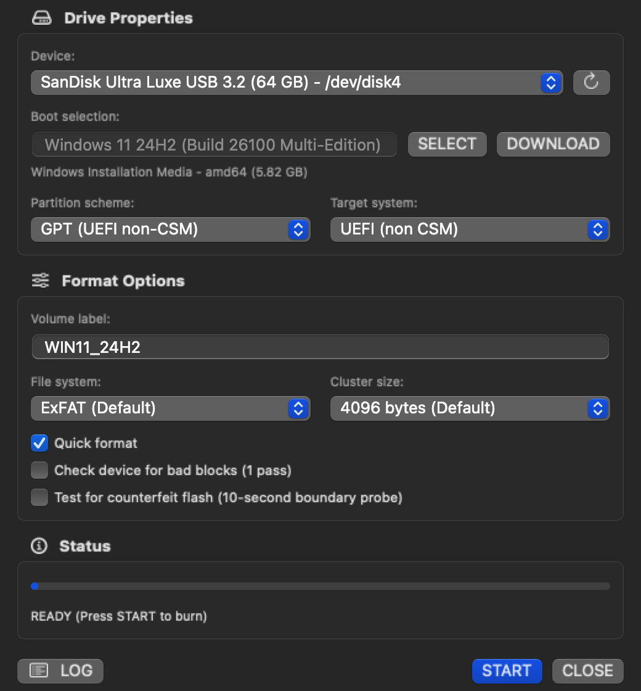
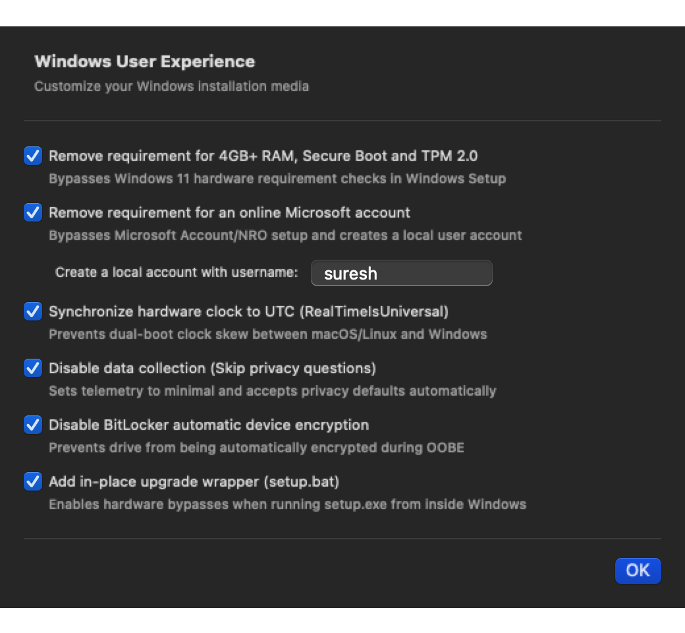
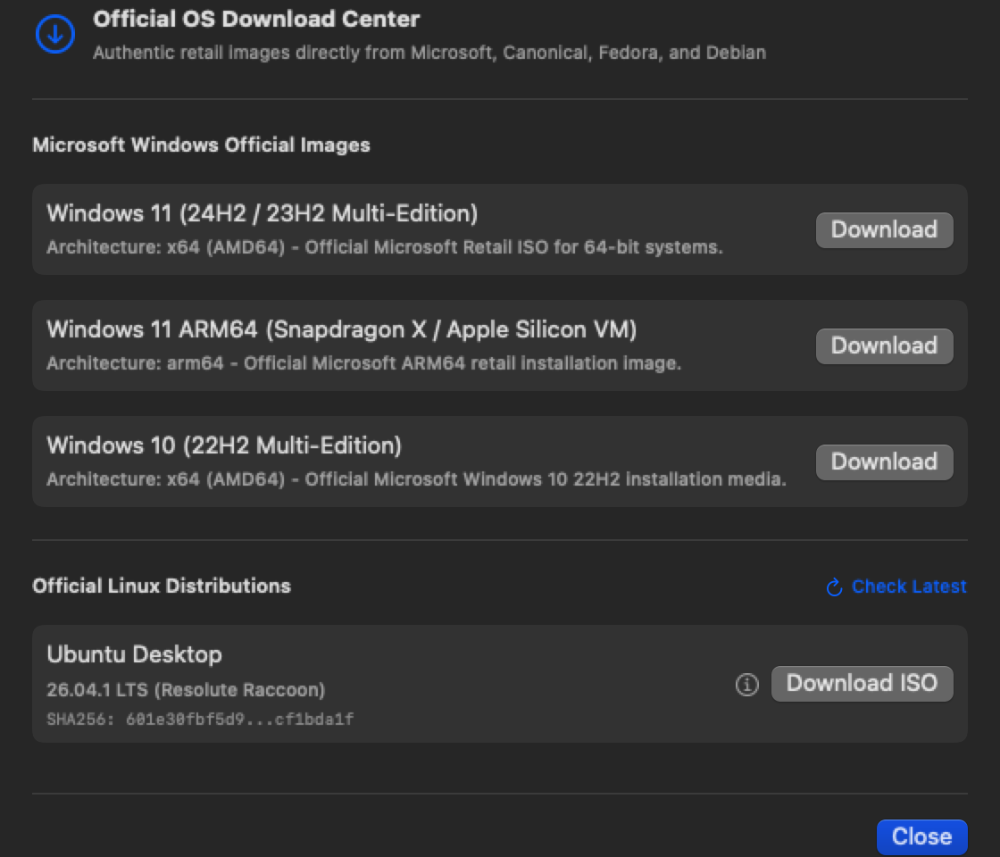
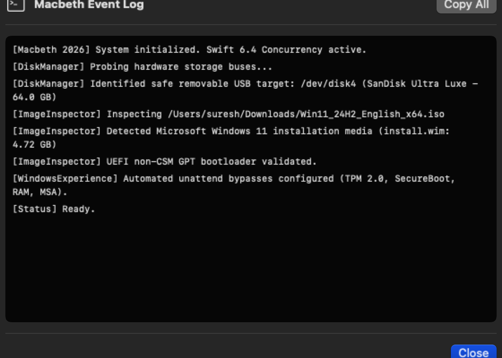

<p align="center">
  
</p>

<h1 align="center">Macbeth for macOS</h1>

<p align="center">
  <strong>A Bootable USB & Installation Media Creator for Mac</strong><br>
  Engineered in Swift 6 for Apple Silicon & Intel macOS (macOS 14 Sonoma, macOS 15 Sequoia, and beyond).
</p>

<p align="center">
  
  
  
  
  
  
</p>

---

> [!NOTE]
> ### 🤖 100% Vibe-Coded
> **Macbeth is 100% vibe-coded.** Every single component—from the high-speed raw POSIX block streamer and low-level IOKit hardware disk guardrails, to the Windows 11 unattend XML injection engine and native SwiftUI interfaces—was conceived, architected, debugged, and implemented entirely through **natural language AI prompting and autonomous agent pairing**.
>
> Not a single line of Swift was hand-written. This project serves as an active testbed and living portfolio piece for honing and mastering advanced AI prompting, autonomous SDLC directives, and prompt-driven systems engineering.

---

## Overview

**Macbeth** brings the power, speed, and deep customization of Windows tools like **Rufus** natively to macOS. 

Flashing Windows 11, Linux distributions, or raw OS images on a Mac has historically required archaic command-line `dd` hacks, third-party FAT32/WIM splitting scripts, or slow virtualization workarounds. Macbeth solves this completely by providing a dedicated, high-performance, and safety-hardened native pipeline with automated unattend generation, hardware drive protection, and dynamic upstream ISO cataloging.

---

## Screenshot Gallery

| Main Flashing Interface | Windows 11 Customization |
| :---: | :---: |
|  |  |
| **Official OS Download Center** | **Real-Time Audit Log** |
|  |  |

---

## Key Features

### 🪟 Windows 11 Automated Experience & Bypass Engine
* **Bypass Hardware Checks**: Automates XML injection (`autounattend.xml` and `setup.bat`) to bypass Windows 11 TPM 2.0, Secure Boot, minimum 4GB RAM, and CPU/storage restriction checks during clean installs or in-place upgrades.
* **Bypass Online Account (MSA)**: Forces Windows Setup to allow creating a pure local offline user account.
* **Prevent Device Encryption**: Automatically disables BitLocker device encryption on fresh installs.
* **RTC-to-UTC Dual Boot Sync**: Injects registry flags (`RealTimeIsUniversal = 1`) so dual-booting Mac/Linux alongside Windows maintains identical hardware clock synchronization.
* **Large WIM Handling**: Seamlessly formats GPT / ExFAT or splits monolithic `install.wim` files exceeding the 4 GB single-file limit of FAT32.

### 🐧 Live Upstream Linux Catalog & Resolution
* **Zero Staleness**: Does not rely on outdated static links. Queries upstream distribution APIs and release manifests dynamically at runtime:
  * **Debian**: Dynamically parses official `SHA256SUMS` to discover latest point releases (e.g. Debian 13.7.0 Trixie) with cryptographic checksum validation.
  * **Ubuntu**: Queries Canonical's official `meta-release-lts` manifest.
  * **Fedora**: Interrogates official Fedora Project releases JSON API.
  * **Arch Linux**: Tracks monthly rolling snapshots.
* **Resilient Offline Fallback**: Safely falls back to pre-verified baselines if network connectivity is absent.

### 🛡️ Enterprise-Grade Drive Safety & Counterfeit Flash Detection
* **Physical Bus Protection**: Deep hardware inspection automatically hides and rejects non-removable internal drives (Apple Fabric, internal NVMe, PCIe APFS containers) and Time Machine backup volumes.
* **10-Second Counterfeit Flash Probe**: Quick boundary write/read verification detects spoofed USB drives (e.g. fake 2TB drives that overwrite memory loops).
* **Automated Label Sanitization**: Enforces strict FAT32 (11 uppercase chars) and ExFAT (15 chars) volume label standards.

### ⚡ Raw POSIX Block Streaming
* Direct raw character device access (`/dev/rdiskX`) with optimized buffer alignment ensures near-theoretical maximum write speeds across USB 3.2 Gen 2 and Thunderbolt flash storage.
* Non-blocking real-time throughput metrics (MB/s), ETA calculations, and background power assertions (`IOPMAssertionCreateWithName`) prevent system sleep during active burn cycles.

---

## Getting Started

### Installation

#### Prebuilt App Bundle
Download the latest `Macbeth.app` from the [Releases](https://github.com/kingsuresh-dotcom/macbeth/releases) tab and drag it to `/Applications`.

#### Command-Line Tool
To install the standalone headless CLI tool:
```bash
cp /Applications/Macbeth.app/Contents/MacOS/macbeth ~/.local/bin/macbeth
```

---

## CLI Reference

Macbeth includes a complete command-line interface (`macbeth`) for terminal automation and headless scripting:

```bash
# List all safe external USB/storage targets
macbeth list

# Inspect an ISO or bootable image payload
macbeth inspect ~/Downloads/Win11_24H2_English_x64.iso

# Test a USB drive for counterfeit/fake storage boundary loops
macbeth test-fake-flash /dev/disk4

# Flash Windows 11 with automated bypasses to a USB target
sudo macbeth write --device /dev/disk4 --image ~/Downloads/Win11_24H2_English_x64.iso --label "WIN11_USB"

# Raw DD image flashing for hybrid Linux ISOs
sudo macbeth write --device /dev/disk4 --image ~/Downloads/archlinux-x86_64.iso --dd
```

---

## Architecture & Codebase

The Macbeth codebase is modularized under Swift Package Manager:

* **`MacbethCore`**: Pure Swift business logic, device discovery, unattend generator, inspection engine, POSIX streaming, and diagnostic scanners.
* **`MacbethApp`**: Modern SwiftUI macOS desktop application with reactive state management and dynamic catalog resolution.
* **`MacbethCLI`**: High-performance headless CLI wrapper.
* **`MacbethTests`**: Automated test suite with 100% strict concurrency verification.

For in-depth design documentation and architectural diagrams, see [ARCHITECTURE.md](docs/ARCHITECTURE.md).

---

## Building from Source

### Prerequisites
* macOS 14.0 (Sonoma) or newer
* Xcode 16+ or Apple Command Line Tools (Swift 6.0+)

### Build & Test
```bash
# Clone the repository
git clone https://github.com/kingsuresh-dotcom/macbeth.git
cd macbeth

# Run the automated test suite
swift run macbeth-tests

# Build application bundle
swift build -c release
./scripts/package_app.sh
```

---

## License

Macbeth is released under the [MIT License](LICENSE).
Copyright &copy; 2026 [kingsuresh-dotcom](https://github.com/kingsuresh-dotcom).
