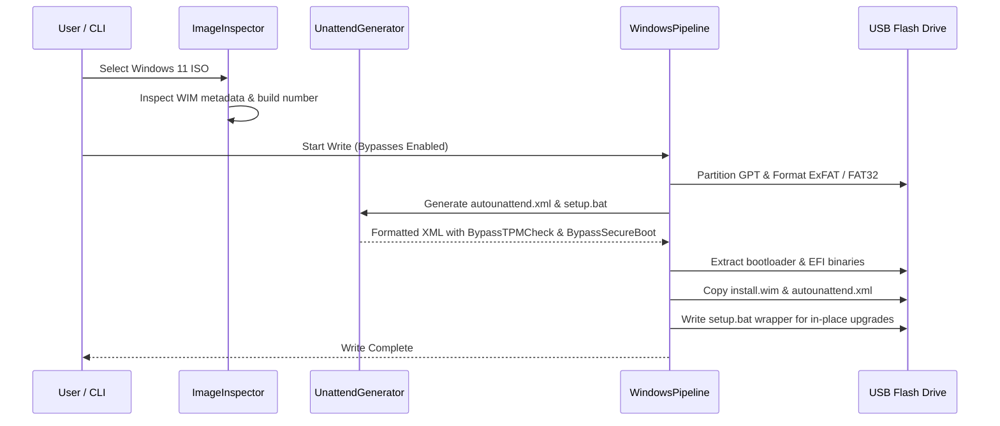

# Macbeth Architecture & Technical Specification

Macbeth is engineered as a modular, concurrency-safe native macOS system for preparing installation media and bootable storage devices.

```mermaid
graph TD
    UI[MacbethApp - SwiftUI] --> VM[MacbethViewModel - ObservableObject]
    CLI[MacbethCLI - Posix Command Line] --> Core[MacbethCore]
    VM --> Core
    
    subgraph MacbethCore Architecture
        Core --> DiskMgr[DiskManager & DiskSafety Guardrails]
        Core --> Insp[ImageInspector & ChecksumEngine]
        Core --> Cat[LinuxCatalog Dynamic Resolver]
        Core --> Diag[FakeFlash & BadBlock Scanners]
        Core --> WinPipe[WindowsPipeline & UnattendGenerator]
        Core --> RawStream[PosixRawStreamer Engine]
    end
    
    subgraph Low-Level System / Hardware
        DiskMgr --> DADisk[DiskArbitration / IOKit / diskutil]
        RawStream --> RawDev[/dev/rdiskX Block Streaming]
        WinPipe --> HdiUtil[hdiutil mount / newfs_msdos / newfs_exfat]
    end
```

---

## 1. Concurrency & Swift 6 Safety Model

Macbeth is built using Swift 6's Strict Concurrency model (`-enableExperimentalFeature StrictConcurrency`):

* **Immutable Domain Entities**: Data models (`DiskDevice`, `ImageInfo`, `DistroRelease`, `WindowsExperience`) conform to `Sendable` and are value types.
* **Separation of Concerns**: Non-UI tasks such as disk probing, SHA-256 calculation, and raw streaming are fully asynchronous (`async`/`await`), ensuring the main thread remains unblocked.
* **Power Assertions**: Long-running operations create `IOPMAssertionCreateWithName` assertions to prevent macOS display or CPU sleep during write operations.

---

## 2. Windows 11 Bypass & Unattend Pipeline

When a Windows ISO is flashed, Macbeth automates the bypasses required for modern hardware installations:



### Unattend Injection Matrix
* **TPM 2.0 Check**: Injected into `Microsoft-Windows-Setup/RunSynchronous` via `BypassTPMCheck = 1`.
* **Secure Boot Check**: `BypassSecureBootCheck = 1`.
* **RAM / CPU / Storage**: `BypassRAMCheck = 1`, `BypassCPUCheck = 1`, `BypassStorageCheck = 1`.
* **Local Account**: Injects `OOBE/ProtectYourPC = 3` and automated local administrative credentials.
* **BitLocker Device Encryption**: `PreventDeviceEncryption = true` in Windows PE unattend schema.
* **UTC Clock Sync**: Registry DWORD `RealTimeIsUniversal = 1` in `HKLM\SYSTEM\CurrentControlSet\Control\TimeZoneInformation`.

---

## 3. Hardware Disk Safety Engine

Accidental writes to internal disks or system backup drives are prevented at the architecture layer:

| Check | Criterion | Action |
| :--- | :--- | :--- |
| **Bus Protocol** | Bus is `Apple Fabric`, `PCI-Express`, or internal NVMe | **Rejected** with fatal safety error |
| **Mount Points** | Contains `/`, `/System`, or `/System/Volumes/Data` | **Rejected** |
| **Time Machine** | Volume marked with Time Machine metadata | **Rejected** |
| **Capacity Loop** | Drive reports 0 bytes or exceeds physical flash boundaries | **Rejected** |
| **Removable Protocol** | Bus is `USB`, `Thunderbolt` external, or SD Card | **Allowed** |

---

## 4. Dynamic Upstream Catalog

Rather than statically hardcoding ISO URLs that rot when distributions increment point releases, Macbeth queries live upstream mirrors:

* **Debian**: Parses `https://cdimage.debian.org/debian-cd/current-live/amd64/iso-hybrid/SHA256SUMS` dynamically for active point releases (e.g. Debian 13.7.0 Trixie) and verified checksums.
* **Ubuntu**: Parses `https://changelogs.ubuntu.com/meta-release-lts` for latest active LTS distribution releases.
* **Fedora**: Interrogates `https://fedoraproject.org/releases.json` for latest production Workstation ISOs.
* **Arch Linux**: Queries `https://archlinux.org/releng/releases/json/` for active monthly snapshot versions.
